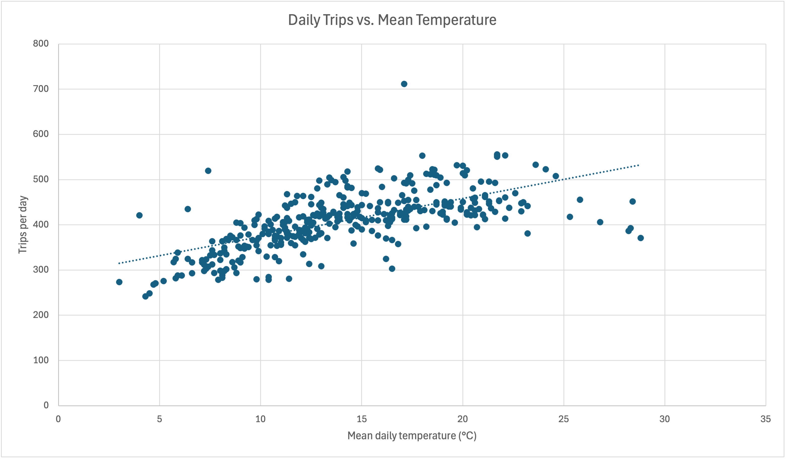
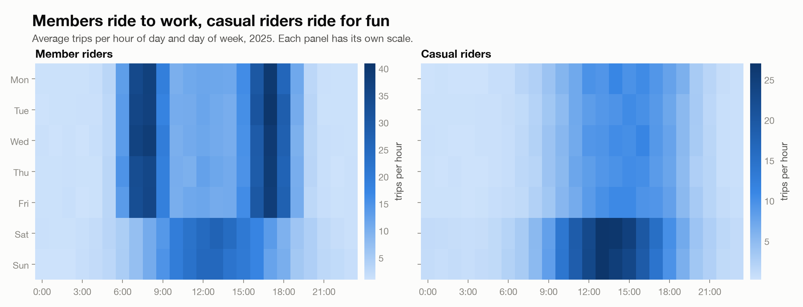
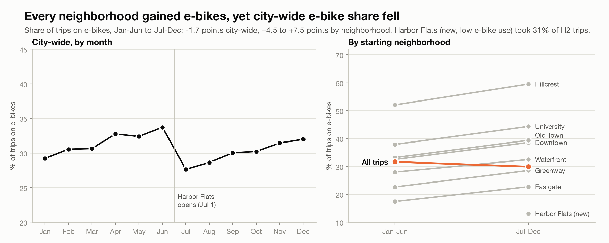
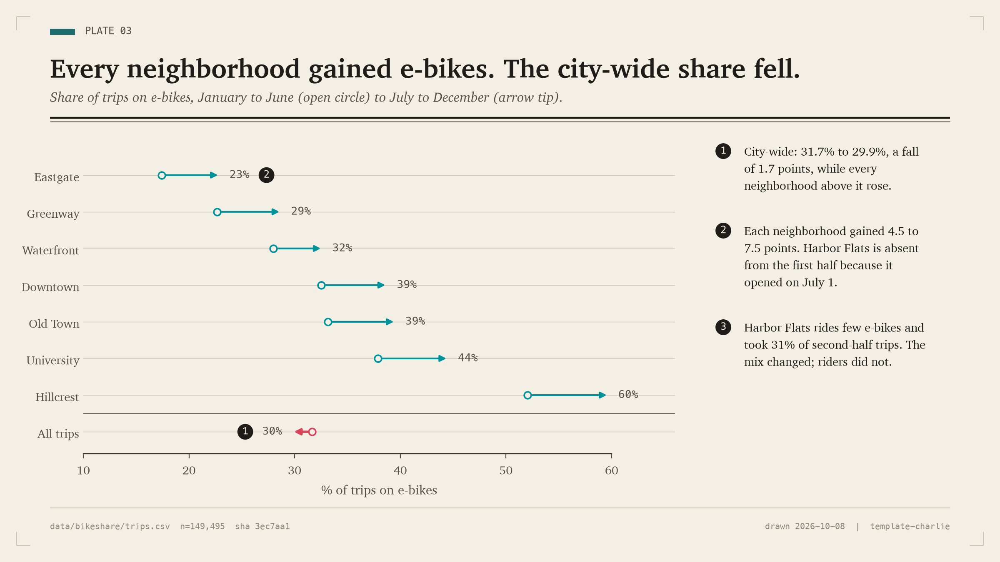
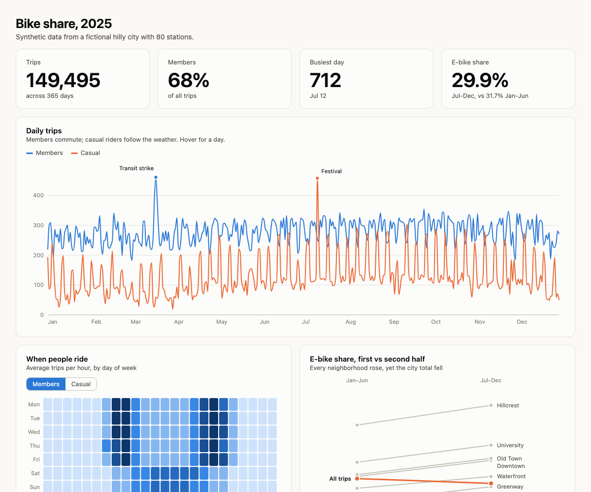
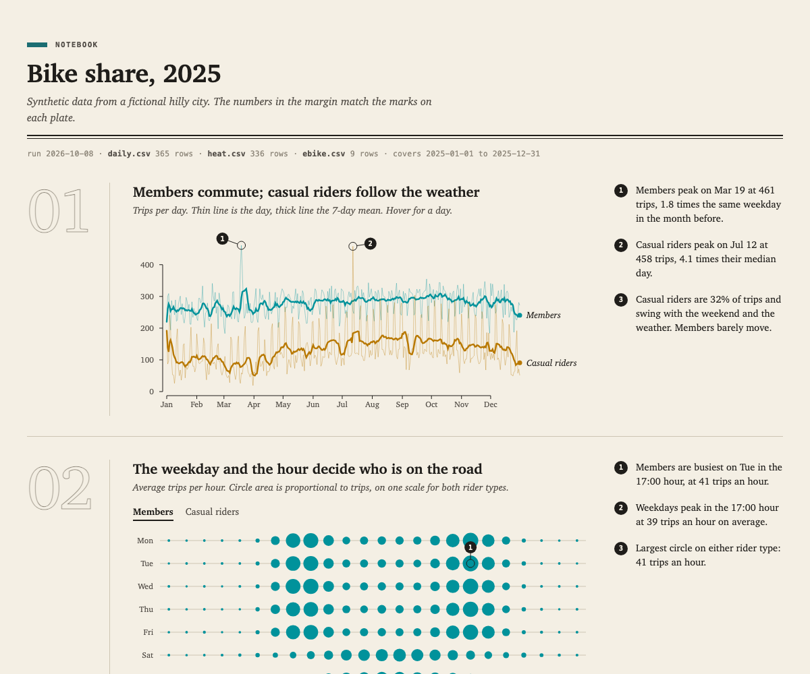
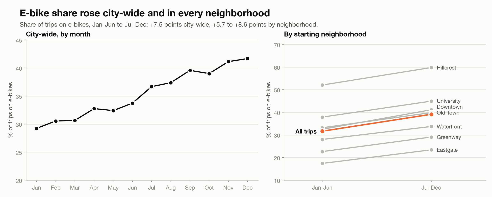

# Talk {visibility="hidden"}

## 150,000 bike trips, four CSV files, one folder

::: {.text-md}
:::: {.columns}
::: {.column width="60%"}

The data is synthetic: one year of a fictional bike-share system.

| File | Rows | Holds |
|---|---|---|
| `trips.csv` | 149,495 | One row per trip |
| `stations.csv` | 80 | Location, elevation, opening date |
| `weather.csv` | 8,760 | Hourly temperature, rain, wind |
| `daily_summary.csv` | 365 | Trips per day plus weather |

:::
::: {.column width="40%"}
::: {.callout-note appearance="simple"}
### The plan
Four ways to turn these files into a plot, each with less effort from me: Excel by hand, Excel with Claude, Claude Code, and Claude Code with skills.
:::
:::
::::
:::

::: {.notes}
1 min. Say the goal: every step ends with something I can hand to someone else (a chart, a page, a file).
:::

## Excel by hand {.slide-data}

::: {.text-md}
:::: {.columns}
::: {.column width="42%"}

- 150,000 trips across four sheets is **too much to read**
- This one chart, trips per day against temperature, **took a while to build**
- It is a plain scatter plot. It cannot say who rides when, or what caused the spikes

:::
::: {.column width="58%"}

{.img-frame fig-alt="Excel scatter plot of daily trips against mean daily temperature with a dotted trend line"}

:::
::::
:::

::: {.notes}
1 min. Set up the problem: effort is high and the chart answers little.
:::

## Excel with Claude {.slide-flow}

::: {.text-md}
Open the Claude add-in in `bike_data.xlsx` and ask in plain language. Claude reads the sheets, builds the chart and writes the formulas.
:::

::: {.text-sm}
::: {.scroll-box .short}
```{.text}
What is on each tab? One line each.

Which was the busiest day in daily_summary?

Compare member and casual trips by day of week. Put a chart on a new tab.

How much do trips fall as the temperature drops? Chart it and tell me the number.

Add a weekday/weekend column and show how the rider mix differs between them.
```
:::
:::

::: {.notes}
3 min, live. Run two prompts (the busiest day and the day-of-week chart). Close the file in Excel before Claude edits it.
:::

## Claude Code: one prompt, one plot {.slide-flow}

::: {.text-md}
Excel is limited to what fits in a sheet. The **Code** tab in the Claude desktop app runs Python on the whole folder.

1. Open the **Code** tab
2. Start a project in the folder that holds `data/`
3. Prompt it:
:::

::: {.text-sm}
::: {.scroll-box .short}
```{.text}
Using the data/bikeshare data, plot the temperature and trips per day.
```
:::
:::

::: {.notes}
2 min, live. Point out that it reads the CSVs itself and that the plot is saved as a PNG you can reuse.
:::

## A skill is instructions Claude reads for you {.slide-code}

::: {.text-md}
That plot is fine, but it is what Claude chose by default. To get the same result every time, write the instructions down once as a **skill** and use it in any session.

- A skill is a folder with a `SKILL.md` file, plus any scripts or examples
- Upload a zip in Claude desktop (**Customize > Skills**), or keep the folder in `.claude/skills`
- Call it by name with a slash command, for example `/dashboard-export`

My first skill, **`dashboard-export`**, tells Claude that a dashboard is never only a link. It also saves one HTML file, plus an SVG, a PNG and **the R code** of every plot.

The page Claude publishes is a **Claude Dashboard**: an interactive page on claude.ai with hover tooltips, tabs and filters. It can refresh from the data behind it, show where each number comes from, and be shared with one link. The exported HTML is a frozen copy of that page.
:::


## Skill 1: `dashboard-export` {.slide-code}

::: {.text-md}
I ask five specific questions, so Claude has to choose the chart form for each:
:::

::: {.text-xs}
::: {.scroll-box .short}
```{.text}
/dashboard-export Build a dashboard of data/bikeshare
 
Answer five questions, one plot each, in this order:
1. Who rides when? Average trips by hour and weekday, members versus casual riders.
2. How does weather change riding? Trips per day against temperature and rain.
3. Which days stand out? A calendar of the year that marks the biggest days.
4. Did e-bikes gain share? E-bike share by neighborhood, first half of the year versus second half, and the city total.
5. Where do bikes pile up? Net flow by station: which stations fill and which drain.
Pick the chart form that fits each question. Skip plain bar, pie and scatter charts unless one is truly the best choice. 
```

:::
:::

::: {.notes}
4 min. This run takes several minutes live. Start it, then talk through the next slide while it works, or show a run you finished earlier.
:::

## What it made, and what is missing {.slide-data}

::: {.text-md}
:::: {.columns}
::: {.column width="55%"}

{.img-frame fig-alt="Two heatmaps of average trips by hour and weekday, one for members and one for casual riders"}

:::
::: {.column width="45%"}

- The page is published, and the SVGs, PNGs and **R scripts** are on disk
- Each plot has a `.R` file and a `.csv` of its rows, so I can open it in R and **edit the figure myself**: change a color, a label, a title or the chart form
- The charts are correct and clearly labeled
- **Claude made every design choice:** the fonts, colors, forms and wording
- It looks like any other AI chart

:::
::::
:::

::: {.notes}
1 min. Open out/ in Finder to show index.html, plots/*.svg, *.png and *.R. Open one .R file in RStudio and change a color live.
:::

## Skill 2: `template-charlie` {.slide-code}

::: {.text-md}
A skill is more than one file. This one is **my chart style, written so Claude can follow it**, and it is built from four parts:

:::: {.columns}
::: {.column width="52%"}

| Part | What it tells Claude |
|---|---|
| `SKILL.md` | The ten rules, what to avoid, and the order to work in |
| `reference/` | How to pick a chart form, the palette, the code API |
| `plate.py`, `plate.js` | Working code, so the style is drawn, not described |
| `examples/gallery/` | Finished plots to match |

:::
::: {.column width="48%"}

- **Do:** a headline that states the finding, margin notes with computed numbers, labels on the lines, a source line on every plot
- **Do not:** KPI tiles, pie charts, boxed legends, dual axes, a title that only names the chart

:::
::::

**Why it matters:** without it, every session invents a new style. With it, a plot from today and one from next month look like the same author made them.
:::

::: {.notes}
2 min. The "do not" list is the point: a skill can forbid things, not only ask for them. Ask the room how many of them have seen a KPI-tile dashboard.
:::

## Skill 2 in use {.slide-code}

::: {.text-md}
Skills stack. The `template-charlie` style skill decides how it looks and `dashboard-export` still saves the files:
:::

::: {.text-xs}
::: {.scroll-box .short}
```{.text}
/dashboard-export /template-charlie Build a dashboard of data/bikeshare
 
Answer five questions, one plot each, in this order:
1. Who rides when? Average trips by hour and weekday, members versus casual riders.
2. How does weather change riding? Trips per day against temperature and rain.
3. Which days stand out? A calendar of the year that marks the biggest days.
4. Did e-bikes gain share? E-bike share by neighborhood, first half of the year versus second half, and the city total.
5. Where do bikes pile up? Net flow by station: which stations fill and which drain.
Pick the chart form that fits each question. Skip plain bar, pie and scatter charts unless one is truly the best choice. 
```

:::
:::

::: {.notes}
3 min. Start the run, then move to the comparison slides while it works. If two slash commands in one prompt do not both load, run them as two prompts.
:::

## Same facts, two looks {.slide-data}

::: {.text-sm}
:::: {.columns}
::: {.column width="50%"}

**Default Claude**

{.img-frame .short fig-alt="Slope chart and monthly line of e-bike share in the default clean chart style"}

:::
::: {.column width="50%"}

**With `template-charlie`**

{.img-frame .short fig-alt="The same finding as an arrow dumbbell chart on warm paper with numbered margin notes"}

:::
::::

::: {.text-xs}
An illustration, not a benchmark. Same prompt both times; the right run starts with `/template-charlie`:

```{.text}
Using data/bikeshare/trips.csv, did the e-bike share of trips change between the first and second half of 2025? Compare each starting neighborhood and the whole city. If the neighborhoods and the city disagree, show why. Make one figure for a slide.
```

In my opinion the skill shows **Simpson's paradox** better: the arrows show every neighborhood rising while the city falls, and the percentages are printed on the plot instead of left to a simple line.
:::
:::

::: {.notes}
2 min. This is one demo run to show the difference, not a controlled test. For the plain run, use a project without template-charlie installed, or it may load on its own.
:::

## The dashboard, two ways {.slide-data}

::: {.text-sm}
:::: {.columns}
::: {.column width="50%"}

**Cards, KPI tiles, legend**

{.img-frame fig-alt="Dashboard with rounded cards and large KPI tiles"}

:::
::: {.column width="50%"}

**Notebook plates**

{.img-frame fig-alt="Dashboard styled as notebook plates with margin notes and a ledger readout"}

:::
::::

Same data, same export skill. Only the style skill changed.
:::

## Take it home {.slide-flow}

::: {.text-md}
:::: {.columns}
::: {.column width="55%"}

1. Start with **plain prompts**. They are enough for a first chart
2. When you repeat yourself, **write a skill**
3. Put your **style** in a skill, so Claude stops choosing for you
4. Ask Claude to **look at its own output** before it says it is done

:::
::: {.column width="45%"}

- **These slides:** [graphtalk.charlespeterson.dev](https://graphtalk.charlespeterson.dev)
- **Code, data, skills:** [github.com/charliecpeterson/graphtalk](https://github.com/charliecpeterson/graphtalk/)
- **Copy and paste:** `docs/prompts.md` has every prompt, and the appendix shows them too

:::
::::
:::

::: {.notes}
1 min, then questions.
:::

# Questions {background-color="#1C6D72"}

# Extra Slides {background-color="#1C6D72" visibility="uncounted"}

## Appendix: every prompt {.slide-code visibility="uncounted"}

::: {.text-xs}
The same text is in `docs/prompts.md` in the repo.

::: {.scroll-box .tall}

:::
:::

## Drop Harbor Flats and the headline rewrites itself {.slide-data visibility="uncounted"}

::: {.text-md}
{.img-frame fig-alt="Figure titled: e-bike share rose city-wide and in every neighborhood"}

City-wide change goes from **-1.7** to **+7.5** points. The title and subtitle are computed from the data, not typed.
:::

## Appendix: gotchas found in rehearsal {visibility="uncounted"}

::: {.text-md}

- **Excel does not reload.** Close the file in Excel before Claude edits it, then reopen. Saving over Claude's edit discards it.
- **Edit the right file.** The dashboard reads small aggregated CSVs, not `trips.csv`. Cleaning `trips.csv` leaves `daily_summary.csv` stale.
- **A cleaning edit is a weak demo.** Removing false starts changes under 1% of pixels. Removing a neighborhood changes the story.
- **Check the skill upload before the talk.** Confirm which skills Claude desktop and Claude Code each see; the Code tab may only read `.claude/skills`. The prompts name `skills/<name>/SKILL.md` so they work either way.
- **Check the projector.** The dashboard follows the machine's light or dark setting.
- **Keep the answer key out of Claude's way.** `author/ANSWER_KEY.md` lists every planted finding. Move `author/` out of the project folder before the demo.

:::
